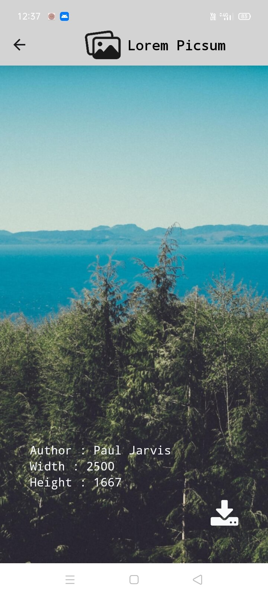

<!-- PROJECT LOGO -->
 

  

  <h3 align="center">Lorem Picsum</h3>

  

    An awesome app for downloading hd images made with React Native!
     
    <a href="https://github.com/Muhammed-Rahif/Lorem-Picsum/">Github Link</a>
    ·
    <a href="https://github.com/Muhammed-Rahif/Lorem-Picsum/issues/">Report Bug</a>
    ·
    <a href="https://github.com/Muhammed-Rahif/Lorem-Picsum/pulls/">Send a Pull Request</a>
  

---

## 📱️ Screenshots 

  
  
  

## ⛏️ Built Using 

- [React Native](https://reactnative.dev/) - React Native is a JavaScript framework for building cross platform softwares
- [Expo](https://expo.dev/) - Expo is an open-source platform for making universal native apps for Android, iOS, and the web with JavaScript and React.

## ✍️ Authors 

- [@Muhammed-Rahif](https://github.com/Muhammed-Rahif) - Idea & Full work
